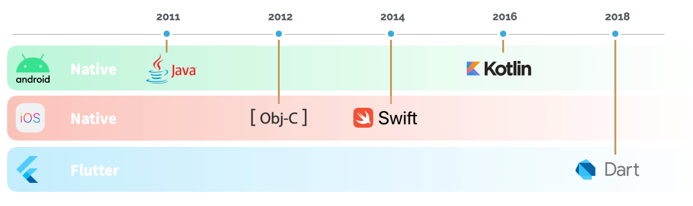

### 💡 About Me
Professional Software Engineer with a passion for mobile technology. Experienced designer, trainer, and team lead with a focus on best practices and excellence.

- I speak: 🇮🇹  🇬🇧
- My passions: 🏋🏻‍♂️  🎵  🛫 📱 💻

### 📱 Mobile Experience
My first approach to mobile development was in 2011 when I built my first Android app in Java. I got so passionate about the
mobile world that few months later I developed my first iOS app in Obj-C. Since then, I always wanted to stay updated with the
cutting edge technologies, so I studied Swift (2014) and Kotlin (2016). In 2018 I decided to put my focus on Flutter and started
to develop apps in Dart, while always keeping an eye to the native mobile development world.

### 🌟 Some of my apps

- &nbsp;&nbsp;[MyLibretto](https://lorenzogreco.com/apps/myLibretto/)

- &nbsp;&nbsp;[Lettore Fattura Elettronica](https://play.google.com/store/apps/details?id=com.lorenzogreco.fatturaelettronica&hl=en_GB&gl=US)

- &nbsp;&nbsp;[MasterDex](https://lorenzogreco.com/apps/masterdex/)

- &nbsp;&nbsp;[Codice Fiscale e Carta d'identità](https://play.google.com/store/apps/details?id=com.lorenzogreco.cfdicreator&hl=en_GB&gl=US)

- &nbsp;&nbsp;[ToU](https://lorenzogreco.com/apps/tou/)
